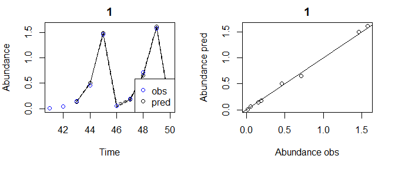
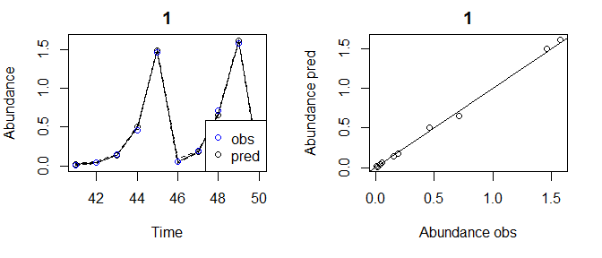

<!-- README.md is generated from README.Rmd. Please edit that file -->

# GPEDM

<!-- badges: start -->
<!-- badges: end -->

**Disclaimer: This is a very much a work in progress. Use at your own
risk.**

This is version 0.0.0.9002

This package contains functions for fiting hierarchical, separable
length scale GP models with automatic relevance determination (ARD) for
use in Empirical Dynamic Modeling (EDM) and other applications. This is
an adaptation of code originally developed by Stephan Munch in MATLAB.

The main function is `fitGP` which is used to train the model and can
also produce predictions if desired. Use `summary.GP` to view a summary,
`predict.GP` to generate other or additional predictions from a fitted
model, `plot.GPpred` to plot observed and predicted values and
`getconditionals` to obtain conditional reponses. Also available for use
are the functions `makelags` which can be used to create delay vectors,
and `getR2` for getting R2 values. See the (not yet created) vignette
for more detailed instructions.

## Installation

To install the package:

``` r
install.packages("devtools") #if required
devtools::install_github("tanyalrogers/GPEDM")
```

If you are using Windows, you may need to install
[Rtools](https://cran.r-project.org/bin/windows/Rtools/), which allows
you to complile the C++ code.

## Basic Use

Here are some simulated data from 2 populations with theta logistic
dynamics. The data contain some small lognormal process noise, and the
populations have different theta values.

``` r
library(GPEDM)
data("thetalog2pop")

pA=subset(thetalog2pop,Population=="PopA")
pB=subset(thetalog2pop,Population=="PopB")
N=nrow(pA)
par(mfrow=c(2,2),mar=c(4,4,2,1))
plot(Abundance~Time,data=pA,type="l",main="PopA")
plot(Abundance~Time,data=pB,type="l",main="PopB")
plot(pA$Abundance[1:(N-1)],pA$Abundance[2:N],
     xlab="Abundance t",ylab="Abundance t+1",main="PopA")
plot(pB$Abundance[1:(N-1)],pB$Abundance[2:N],
     xlab="Abundance t",ylab="Abundance t+1",main="PopB")
```


Here is how you might set up a hierarchical time-delay embedding model.
In this example, `Abundance` is the response variable (`y`). We will use
an embedding dimension (`E`) of 3 and time delay (`tau`) of 1.
`Population` indicates which population the data are from, so it is
included under `pop`. Since the data are on somewhat different scales
and don’t necessarily represent the same ‘units’, we will use local
(within population) data scaling, as opposed to global. Just for fun, we
will also request leave-one-out predictions.

``` r
tlogtest=fitGP(data = thetalog2pop, y = "Abundance", pop = "Population", E=3, tau=1, 
               scaling = "local", predictmethod = "loo")
summary(tlogtest)
#> Number of predictors: 3 
#> Length scale parameters:
#>        predictor posteriormode
#> phi1 Abundance_1         0.529
#> phi2 Abundance_2         0.000
#> phi3 Abundance_3         0.000
#> Process variance (ve): 0.01221358
#> Pointwise prior variance (sigma2): 2.53986
#> Number of populations: 2
#> Dynamic correlation (rho): 0.3250464
#> In-sample R-squared: 0.9933951 
#> In-sample R-squared by population:
#>             R2
#> PopA 0.9970774
#> PopB 0.9815181
#> Out-of-sample R-squared: 0.991239
#> Out-of-sample R-squared by population:
#>             R2
#> PopA 0.9961232
#> PopB 0.9754852
```

From the summary, we can see that ARD has (unsurprisingly) deemed lags 2
and 3 to be unimportant (length scales are 0), so E=1 is probably
sufficient. The dynamic correlation (rho) tells us the degree to which
the dynamics are correlated (they are are rather dissimilar in this
case). Since the simulated data don’t contain that much noise, the
R-squared values are quite high.

### Plot observed and predicted values

The observed and predicted values can be found under
`model$insampresults` or `model$outsampresults`.

We can make a quick plot of the observed and predicted values using
`plot`. Standard error bands are included in the time series plots,
although they’re a little hard to see in this example.

``` r
plot(tlogtest)
#> Plotting out of sample results.
```


To get the in-sample predictions:

``` r
plot(tlogtest, plotinsamp = T)
#> Plotting in sample results.
```


If you prefer ggplot:

``` r
library(ggplot2)
ggplot(tlogtest$insampresults,aes(x=timestep,y=predmean)) +
  facet_wrap(pop~., scales = "free") +
  geom_line() + geom_ribbon(aes(ymin=predmean-predfsd,ymax=predmean+predfsd), alpha=0.4) +
  geom_point(aes(y=obs)) +
  theme_bw()
#> Warning: Removed 3 rows containing missing values (geom_path).
```


### Plot conditional responses

The function `getconditionals` will compute and plot conditional
responses to each input variable (other input varibles set to their mean
value). From this we can also clearly see that lags 2 and 3 have no
impact, and we can see how the lag 1 dynamics of the 2 populations
differ.

``` r
con=getconditionals(tlogtest)
```


If you prefer ggplot:

``` r
#have to convert conditionals output to long format
#there may be a more concise way to do this
library(tidyr)
npreds=length(grep("_yMean",colnames(con)))
conlong1=gather(con[,1:(npreds+1)],x,xValue,2:(npreds+1))
conlong2=gather(con[,c(1,(npreds+2):(2*npreds+1))],ym,yMean,2:(npreds+1))
conlong3=gather(con[,c(1,(2*npreds+2):(3*npreds+1))],ys,ySD,2:(npreds+1))
conlong=cbind.data.frame(conlong1,yMean=conlong2$yMean,ySD=conlong3$ySD)
ggplot(conlong,aes(x=xValue,y=yMean)) +
  facet_grid(pop~x, scales = "free") +
  geom_line() + geom_ribbon(aes(ymin=yMean-ySD,ymax=yMean+ySD), alpha=0.4) +
  theme_bw()
```


### Plot inverse length scales

The model hyperparameters are located under `model$pars`. If you have
*n* predictors, the first *n* values of `pars` will be the length
scales. Note that if you use `E` and `tau`, the names of the predictors
in the input data frame will be stored under `model$inputs$x_names`, and
the names of the lagged predictors corresponding to the inverse length
scales will be stored under `model$inputs$x_names2`.

``` r
predvars=tlogtest$inputs$x_names2
npreds=length(predvars)
lscales=tlogtest$pars[1:npreds]
par(mar=c(4,4,1,1))
plot(factor(predvars),lscales,xlab="Predictor",ylab="Inverse length scale")
```


### Other types of predictions

We can use the `predict` function to get various types of predictions
from a fitted model. Leave-one-out, `predictmethod = "loo"` is one
option (above, we got these predictions at the same time we fit the
model, but this is not necessary). The following obtains sequential
(leave-future-out) predictions using the training data.

``` r
#sequential predictions (they should improve over time)
seqpred=predict(tlogtest,predictmethod = "sequential")
plot(seqpred)
#> Plotting out of sample results.
```


You could, alternatively, supply new data for which to make predictions.
In that case, you would supply a new data frame (`newdata`). In our
example, this data frame which should contain columns `Abundance` and
`Population`.

A common approach when fitting these models is to split the available
data into a training and test dataset. For instance, say we wanted a
single-population model for PopA with 2 time lags, and we wanted to use
the first 40 data points as training data, and the last 10 points as
test data. For that we could do the following.

``` r
pAtrain=pA[1:40,]
pAtest=pA[41:50,]
tlogtest2=fitGP(data = pAtrain, y = "Abundance", E=2, tau=1,
                newdata = pAtest)
plot(tlogtest2)
#> Plotting out of sample results.
```



If you don’t want the first `E*tau` points getting excluded from your
test data, generate the lags beforehand, then split the data (don’t use
`E` and `tau` options in `fitGP`). See **Specifying training data**
(option 1).

``` r
pAlags=makelags(pA, y = "Abundance", E=2, tau=1)
pAdata=cbind(pA,pAlags)
pAtrain=pAdata[1:40,]
pAtest=pAdata[41:50,]
tlogtest3=fitGP(data = pAtrain, y = "Abundance", x=colnames(pAlags),
                newdata = pAtest)
plot(tlogtest3)
#> Plotting out of sample results.
```



### Making forecasts

You can construct a forecast matrix using `makelags` by setting
`forecast=T` and supplying this as `newdata`. In order to do this (as
the code is currently written), you have to generate the lags beforehand
for *both* the training data and the forecast (you cannot use `E` and
`tau` in `fitGP`, you have to use `makelags` for both, and the settings
in `makelags` should match, other than `forecast`, See **Specifying
training data** option 1). It is a good idea to include the `time`
argument when doing this.

``` r
lags1=makelags(thetalog2pop,y=c("Abundance"),pop="Population",time="Time",E=3,tau=1)
fore1=makelags(thetalog2pop,y=c("Abundance"),pop="Population",time="Time",E=3,tau=1,forecast = T)
data1=cbind(thetalog2pop, lags1)

tlogfore=fitGP(data = data1, y = "Abundance", x=c("Abundance_1","Abundance_2","Abundance_3"), 
               pop = "Population", time = "Time", scaling = "local", newdata = fore1)

ggplot(tlogfore$insampresults,aes(x=timestep,y=predmean)) +
  facet_wrap(pop~., scales = "free") +
  geom_line() + geom_ribbon(aes(ymin=predmean-predsd,ymax=predmean+predsd), alpha=0.4) +
  geom_point(aes(y=obs)) +
  geom_point(data=tlogfore$outsampresults, aes(y=predmean), color="red") +
  geom_errorbar(data=tlogfore$outsampresults,
                aes(ymin=predmean-predsd,ymax=predmean+predsd),color="red") +
  theme_bw()
#> Warning: Removed 3 rows containing missing values (geom_path).
```


## Specifying training data

There are several ways that the training data for a model can be
specified.

A. supply data frame `data`, plus column names or indices for `y` and
`x`.  
B. supply a vector for `y` and a vector or matrix for `x`.

For each of the above 2 options, there are 3 options for specifying the
predictors.

1.  supplying `y` and `x` (omitting `E` and `tau`) will use the columns
    of `x` as predictors. This allows for the most customization.  
2.  supplying `y`, `E`, and `tau` (omitting `x`) will use `E` lags of
    `y` (with spacing `tau`) as predictors. This is equivalent to option
    3 with `x`=`y`.  
3.  supplying `y`, `x`, `E`, and `tau` will use `E` lags of *each
    column* of `x` (with spacing `tau`) as predictors. Do not use this
    option if `x` already contains lags, in that case use option 1.

The above example is method A2. Method A1/B1 allows for the most
customization of response and predictor variables including mixed
embeddings.

Options 2 and 3 exist for convenience, but for the most control over the
model and predictions, it is best to use option 1: use `makelags()` to
generate any lags beforehand and pass appropriate columns to `fitGP`,
rather than rely on `fitGP` to generate lags internally. Option A will
make more sense if your data are already in a data frame, option B may
make more sense if you are doing simulations and just have a bunch of
vectors and matrices.

The `pop` argument is optional in all of the above cases. If omitted, a
single population is assumed.

``` r
set.seed(10)
thetalog2pop$othervar=rnorm(nrow(thetalog2pop))
yvec=thetalog2pop$Abundance
popvec=thetalog2pop$Population
#function 'makelags' can be used to generate a lag matrix
#be sure to include 'pop' if data contain multiple pops to prevent crossover
xmat=makelags(y=thetalog2pop[,c("Abundance","othervar")],pop=popvec,E=2,tau=1)
thetalog2pop2=cbind(thetalog2pop,xmat)

#Method A1
ma1=fitGP(data=thetalog2pop2,y="Abundance",x=c("Abundance_1","othervar"),
         pop="Population",scaling="local")

#Method B1
#like A1, but your data aren't in a data frame
mb1=fitGP(y=yvec,x=xmat,pop=popvec,scaling="local")

#Method B2
#like A2, but your data aren't in a data frame
mb2=fitGP(y=yvec,pop=popvec,E=2,tau=1,scaling="local")

#Method A3
#generate lags of multiple predictors internally
ma3=fitGP(data=thetalog2pop2,y="Abundance",x=c("Abundance","othervar"),
         pop="Population",E=2,tau=1,scaling="local")


summary(ma1)
#> Number of predictors: 2 
#> Length scale parameters:
#>        predictor posteriormode
#> phi1 Abundance_1        0.5208
#> phi2    othervar        0.0003
#> Process variance (ve): 0.01031384
#> Pointwise prior variance (sigma2): 2.539001
#> Number of populations: 2
#> Dynamic correlation (rho): 0.2929397
#> In-sample R-squared: 0.994516 
#> In-sample R-squared by population:
#>             R2
#> PopA 0.9971648
#> PopB 0.9855420

summary(mb1)
#> Number of predictors: 4 
#> Length scale parameters:
#>        predictor posteriormode
#> phi1 Abundance_1       0.50900
#> phi2 Abundance_2       0.00000
#> phi3  othervar_1       0.00028
#> phi4  othervar_2       0.00000
#> Process variance (ve): 0.01026833
#> Pointwise prior variance (sigma2): 2.671209
#> Number of populations: 2
#> Dynamic correlation (rho): 0.2873044
#> In-sample R-squared: 0.9945253 
#> In-sample R-squared by population:
#>             R2
#> PopA 0.9971060
#> PopB 0.9856004

summary(mb2)
#> Number of predictors: 2 
#> Length scale parameters:
#>      posteriormode
#> phi1       0.53027
#> phi2       0.00000
#> Process variance (ve): 0.01205433
#> Pointwise prior variance (sigma2): 2.53792
#> Number of populations: 2
#> Dynamic correlation (rho): 0.3250085
#> In-sample R-squared: 0.9935198 
#> In-sample R-squared by population:
#>             R2
#> PopA 0.9971162
#> PopB 0.9817038

summary(ma3)
#> Number of predictors: 4 
#> Length scale parameters:
#>        predictor posteriormode
#> phi1 Abundance_1       0.50900
#> phi2 Abundance_2       0.00000
#> phi3  othervar_1       0.00028
#> phi4  othervar_2       0.00000
#> Process variance (ve): 0.01026833
#> Pointwise prior variance (sigma2): 2.671209
#> Number of populations: 2
#> Dynamic correlation (rho): 0.2873044
#> In-sample R-squared: 0.9945253 
#> In-sample R-squared by population:
#>             R2
#> PopA 0.9971060
#> PopB 0.9856004
```

## Variable Timestep Method (for missing data)

By default, `fitGP` excludes any rows that contain missing values (NAs)
in either the response or predictor variables. Thus, in a delay
embedding model, a missing datapoint in the middle of a time series will
be excluded as will the following `E` values (assuming `tau` is 1).
Stephan Munch and Bethany Johnson developed a method whereby using the
time spacing between a value and its lagged predictors as another
predictor, we can exclude less data, generate predictions for all
non-missing timepoints, and by adjusting the spacing in the forecast
matrix, generate forecasts multiple timesteps into the future. The
forthcoming paper will contain more details.

Using this method requires that lag predictors be generated beforehand
(option 1 in **Specifying training data**). The `makelags` function has
an option for the variable timestep method (`vtimestep=TRUE`) that will
generate the time difference lags automatically. Including the `time`
argument is strongly recommended, and you definitely need to include it
if the rows with missing values have already been removed and/or the
timesteps are uneven. Argument `Tdiff_max` can be used to set the max
time difference value considered (e.g. if you have one large time gap
that you don’t want to use this method for).

``` r
#just using one population for now, it will also work with multiple populations

#add some missing values
pAmiss=pA
pAmiss[c(7,10,15,23,30,40),"Abundance"]=NA

#standard method
pAmisslags=makelags(data=pAmiss, y="Abundance", time="Time", E=2, tau=1)
head(cbind(pAmiss,pAmisslags),15)
#>    Time Population   Abundance Abundance_1 Abundance_2
#> 1     1       PopA 1.562062989          NA          NA
#> 2     2       PopA 0.016925286 1.562062989          NA
#> 3     3       PopA 0.058327231 0.016925286  1.56206299
#> 4     4       PopA 0.187785349 0.058327231  0.01692529
#> 5     5       PopA 0.645712644 0.187785349  0.05832723
#> 6     6       PopA 1.518965494 0.645712644  0.18778535
#> 7     7       PopA          NA 1.518965494  0.64571264
#> 8     8       PopA 0.089612740          NA  1.51896549
#> 9     9       PopA 0.284009932 0.089612740          NA
#> 10   10       PopA          NA 0.284009932  0.08961274
#> 11   11       PopA 1.155670141          NA  0.28400993
#> 12   12       PopA 0.542262071 1.155670141          NA
#> 13   13       PopA 1.696225429 0.542262071  1.15567014
#> 14   14       PopA 0.002669515 1.696225429  0.54226207
#> 15   15       PopA          NA 0.002669515  1.69622543

#variable timestep method
pAmisslags=makelags(data=pAmiss, y="Abundance", time="Time", E=2, tau=1, vtimestep=T)
head(cbind(pAmiss,pAmisslags),15)
#>    Time Population   Abundance Abundance_1 Abundance_2 Tdiff_1 Tdiff_2
#> 1     1       PopA 1.562062989          NA          NA      NA      NA
#> 2     2       PopA 0.016925286          NA          NA      NA      NA
#> 3     3       PopA 0.058327231 0.016925286  1.56206299       1       1
#> 4     4       PopA 0.187785349 0.058327231  0.01692529       1       1
#> 5     5       PopA 0.645712644 0.187785349  0.05832723       1       1
#> 6     6       PopA 1.518965494 0.645712644  0.18778535       1       1
#> 7     7       PopA          NA 1.518965494  0.64571264       1       1
#> 8     8       PopA 0.089612740 1.518965494  0.64571264       2       1
#> 9     9       PopA 0.284009932 0.089612740  1.51896549       1       2
#> 10   10       PopA          NA 0.284009932  0.08961274       1       1
#> 11   11       PopA 1.155670141 0.284009932  0.08961274       2       1
#> 12   12       PopA 0.542262071 1.155670141  0.28400993       1       2
#> 13   13       PopA 1.696225429 0.542262071  1.15567014       1       1
#> 14   14       PopA 0.002669515 1.696225429  0.54226207       1       1
#> 15   15       PopA          NA 0.002669515  1.69622543       1       1

pAmissdata=cbind(pAmiss,pAmisslags)
vtdemo=fitGP(data=pAmissdata, y="Abundance", x=colnames(pAmisslags), time="Time")

summary(vtdemo)
#> Number of predictors: 4 
#> Length scale parameters:
#>        predictor posteriormode
#> phi1 Abundance_1       0.62721
#> phi2 Abundance_2       0.00000
#> phi3     Tdiff_1       0.00029
#> phi4     Tdiff_2       0.00000
#> Process variance (ve): 0.01
#> Pointwise prior variance (sigma2): 2.44616
#> Number of populations: 1
#> In-sample R-squared: 0.996062

ggplot(vtdemo$insampresults,aes(x=timestep,y=predmean)) +
  geom_line() + 
  geom_ribbon(aes(ymin=predmean-predsd,ymax=predmean+predsd), alpha=0.4, color="black") +
  geom_point(aes(y=obs)) +
  theme_bw()
#> Warning: Removed 2 rows containing missing values (geom_path).
#> Warning: Removed 6 rows containing missing values (geom_point).
```


You can also generate a forecast matrix using the variable timestep
method. The number of timesteps to forecast can be specified with
`Tdiff_fore`.

``` r
pAmissfore=makelags(data=pAmiss, y="Abundance", time="Time", E=2, tau=1,vtimestep=T,  
                    forecast=T, Tdiff_fore=c(1,2))
pAmissfore
#>   Time Abundance_1 Abundance_2 Tdiff_1 Tdiff_2
#> 1   51  0.01543102    1.574257       1       1
#> 2   52  0.01543102    1.574257       2       1

vtpred=predict(vtdemo, newdata = pAmissfore)

ggplot(vtdemo$insampresults,aes(x=timestep,y=predmean)) +
  geom_line() + 
  geom_ribbon(aes(ymin=predmean-predsd,ymax=predmean+predsd), alpha=0.4, color="black") +
  geom_point(aes(y=obs)) +
  geom_point(data=vtpred$outsampresults, aes(y=predmean), color="red") +
  geom_errorbar(data=vtpred$outsampresults,
                aes(ymin=predmean-predsd,ymax=predmean+predsd),color="red") +
  theme_bw()
#> Warning: Removed 2 rows containing missing values (geom_path).
#> Warning: Removed 6 rows containing missing values (geom_point).
```


### Using augmentation data

When using the variable timestep method, the function `makelags` can
also be used to generate an augmentation data matrix that can be passed
to `fitGP`. This should work as long as the settings in `makelags`
match, except use `augment=TRUE`. When the augmentation table is
generated, `makelags` will print a table showing the original number of
each Tdiff combination in the original dataset (Freq), and the total
number of with the augmentation data included (Freq\_new). Combinations
are added up to `nreps`, if possible (currently defaults to 10). By
default, only Tdiff combinations that appear in the original dataset are
used, however, if you supply a vector `Tdiff_fore`, then the
augmentation matrix will include or all possible combinations of the
Tdiff values supplied in `Tdiff_fore`.

``` r
pAmisslags=makelags(data=pAmiss, y="Abundance", time="Time", E=2, tau=1, vtimestep=T)
pAaug=makelags(data=pAmiss, y="Abundance", time="Time", E=2, tau=1, vtimestep=T,  
               augment=T)
#> defaulting to nreps=10
#> Population  1 
#>   Tdiff_1 Tdiff_2 Freq Freq_new
#> 1       1       1   30       30
#> 2       1       2    6       10
#> 3       2       1    6       10
pAaug
#>   Time   Abundance Abundance_1 Abundance_2 Tdiff_1 Tdiff_2
#> 1   45 1.459292768   0.4638699  0.04423792       1       2
#> 2   49 1.574257196   0.7120728  0.05738582       1       2
#> 3   27 1.632670925   0.7130621  0.05990108       1       2
#> 4    6 1.518965494   0.6457126  0.05832723       1       2
#> 5   39 1.666716539   0.2085535  0.06524985       2       1
#> 6   28 0.006731426   0.7130621  0.20609102       2       1
#> 7   34 0.006165824   0.7362201  0.20850963       2       1
#> 8   29 0.020612906   1.6326709  0.71306214       2       1

pAmissdata=cbind(pAmiss,pAmisslags)
vtdemo_aug=fitGP(data=pAmissdata, y="Abundance", x=colnames(pAmisslags), time="Time",
                 augdata=pAaug,newdata=pAmissfore)
summary(vtdemo_aug)
#> Number of predictors: 4 
#> Length scale parameters:
#>        predictor posteriormode
#> phi1 Abundance_1       2.47035
#> phi2 Abundance_2       0.00000
#> phi3     Tdiff_1       0.29540
#> phi4     Tdiff_2       0.00000
#> Process variance (ve): 0.01
#> Pointwise prior variance (sigma2): 3.006319
#> Number of populations: 1
#> In-sample R-squared: 0.9965409

ggplot(vtdemo_aug$insampresults,aes(x=timestep,y=predmean)) +
  geom_line() + 
  geom_ribbon(aes(ymin=predmean-predsd,ymax=predmean+predsd), alpha=0.4, color="black") +
  geom_point(aes(y=obs)) +
  geom_point(data=vtdemo_aug$outsampresults, aes(y=predmean), color="red") +
  geom_errorbar(data=vtdemo_aug$outsampresults,
                aes(ymin=predmean-predsd,ymax=predmean+predsd),color="red") +
  theme_bw()
#> Warning: Removed 2 rows containing missing values (geom_path).
#> Warning: Removed 6 rows containing missing values (geom_point).
```


``` r
vtaloo=predict(vtdemo_aug,predictmethod = "loo")
vtaseq=predict(vtdemo_aug,predictmethod = "sequential")
vtloo=predict(vtdemo,predictmethod = "loo")
vtseq=predict(vtdemo,predictmethod = "sequential")
vtanew=predict(vtdemo_aug,newdata=pAmissfore)
```

## References

Munch, S. B., Poynor, V., and Arriaza, J. L. 2017. Circumventing
structural uncertainty: a Bayesian perspective on nonlinear forecasting
for ecology. Ecological Complexity, 32:134.

Johnson, B., and Munch, S. B. 2022. An empirical dynamic modeling
framework for missing or irregular samples. Ecological Modelling,
468:109948.

*Any advice on improving this package is appreciated.*

## Github Disclaimer

*This repository is a scientific product and is not official
communication of the National Oceanic and Atmospheric Administration, or
the United States Department of Commerce. All NOAA GitHub project code
is provided on an ‘as is’ basis and the user assumes responsibility for
its use. Any claims against the Department of Commerce or Department of
Commerce bureaus stemming from the use of this GitHub project will be
governed by all applicable Federal law. Any reference to specific
commercial products, processes, or services by service mark, trademark,
manufacturer, or otherwise, does not constitute or imply their
endorsement, recommendation or favoring by the Department of Commerce.
The Department of Commerce seal and logo, or the seal and logo of a DOC
bureau, shall not be used in any manner to imply endorsement of any
commercial product or activity by DOC or the United States Government.*
