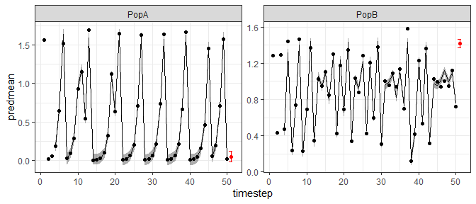

<!-- README.md is generated from README.Rmd. Please edit that file -->

# GPEDM

<!-- badges: start -->
<!-- badges: end -->

**Disclaimer: This is very much a work in progress. Use at your own risk
and please report any problems.**

This is version 0.0.0.9007

This package contains functions for fiting hierarchical, separable
length scale Gaussian process (GP) models with automatic relevance
determination (ARD) for use in Empirical Dynamic Modeling (EDM) and
other applications. This is an adaptation of code originally developed
by Stephan Munch in MATLAB.

The main function is `fitGP` which is used to train the model and can
also produce predictions if desired. Use `summary` to view a summary,
`predict` to generate other or additional predictions from a fitted
model, `plot` to plot observed and predicted values, `update` to update
an existing model, and `getconditionals` to obtain conditional reponses.
Also available for use are the functions `makelags` which can be used to
create delay vectors, and `getR2` for getting R2 values. See [Specifying
training data](#specifying-training-data) and the function documentation
for more detailed instructions.

## Installation

To install the package:

``` r
install.packages("devtools") #if required
devtools::install_github("tanyalrogers/GPEDM")
```

If you are using Windows, you may need to install
[Rtools](https://cran.r-project.org/bin/windows/Rtools/), which allows
you to complile the C++ code.

## Basic Use

Here are some simulated data from 2 populations with theta logistic
dynamics. The data contain some small lognormal process noise, and the
populations have different theta values.

``` r
library(GPEDM)
data("thetalog2pop")

pA=subset(thetalog2pop,Population=="PopA")
pB=subset(thetalog2pop,Population=="PopB")
N=nrow(pA)
par(mfrow=c(2,2),mar=c(4,4,2,1))
plot(Abundance~Time,data=pA,type="l",main="PopA")
plot(Abundance~Time,data=pB,type="l",main="PopB")
plot(pA$Abundance[1:(N-1)],pA$Abundance[2:N],
     xlab="Abundance t",ylab="Abundance t+1",main="PopA")
plot(pB$Abundance[1:(N-1)],pB$Abundance[2:N],
     xlab="Abundance t",ylab="Abundance t+1",main="PopB")
```


Here is how you might set up a hierarchical time-delay embedding model.
In this example, `Abundance` is the response variable (`y`). We will use
an embedding dimension (`E`) of 3 and time delay (`tau`) of 1.
`Population` indicates which population the data are from, so it is
included under `pop`. Since the data are on somewhat different scales
and don’t necessarily represent the same ‘units’, we will use local
(within population) data scaling, as opposed to global. Just for fun, we
will also request leave-one-out predictions.

``` r
tlogtest=fitGP(data = thetalog2pop, y = "Abundance", pop = "Population", E=3, tau=1, 
               scaling = "local", predictmethod = "loo")
summary(tlogtest)
#> Number of predictors: 3 
#> Length scale parameters:
#>        predictor posteriormode
#> phi1 Abundance_1        0.5317
#> phi2 Abundance_2        0.0000
#> phi3 Abundance_3        0.0000
#> Process variance (ve): 0.01222333
#> Pointwise prior variance (sigma2): 2.527349
#> Number of populations: 2
#> Dynamic correlation (rho): 0.327254
#> In-sample R-squared: 0.9933975 
#> In-sample R-squared by population:
#>             R2
#> PopA 0.9970811
#> PopB 0.9815187
#> Out-of-sample R-squared: 0.991238
#> Out-of-sample R-squared by population:
#>             R2
#> PopA 0.9961280
#> PopB 0.9754702
```

From the summary, we can see that ARD has (unsurprisingly) deemed lags 2
and 3 to be unimportant (length scales are 0), so E=1 is probably
sufficient. The dynamic correlation (rho) tells us the degree to which
the dynamics are correlated (they are are rather dissimilar in this
case). Since the simulated data don’t contain that much noise, the
R-squared values are quite high. For more information on choosing
embedding parameters, see [this
vignette](https://tanyalrogers.github.io/GPEDM/articles/choosingE.html).
For more information on hierarchical modeling and the dynamic
correlation, see [this other
vignette](https://tanyalrogers.github.io/GPEDM/articles/hierarchical.html).

### Plot observed and predicted values

The observed and predicted values can be found under
`model$insampresults` or `model$outsampresults`.

We can make a quick plot of the observed and predicted values using
`plot`. Standard error bands are included in the time series plots,
although they’re a little hard to see in this example.

``` r
plot(tlogtest)
#> Plotting out of sample results.
```


To get the in-sample predictions:

``` r
plot(tlogtest, plotinsamp = T)
#> Plotting in sample results.
```


If you prefer ggplot:

``` r
library(ggplot2)
ggplot(tlogtest$insampresults,aes(x=timestep,y=predmean)) +
  facet_wrap(pop~., scales = "free") +
  geom_line() + geom_ribbon(aes(ymin=predmean-predfsd,ymax=predmean+predfsd), alpha=0.4) +
  geom_point(aes(y=obs)) +
  theme_bw()
#> Warning: Removed 3 rows containing missing values (geom_path).
```


### Plot conditional responses

The function `getconditionals` will compute and plot conditional
responses to each input variable (other input varibles set to their mean
value). From this we can also clearly see that lags 2 and 3 have no
impact, and we can see how the lag 1 dynamics of the 2 populations
differ.

``` r
con=getconditionals(tlogtest)
```


If you prefer ggplot:

``` r
#have to convert conditionals output to long format
#there may be a more concise way to do this
library(tidyr)
npreds=length(grep("_yMean",colnames(con)))
conlong1=gather(con[,1:(npreds+1)],x,xValue,2:(npreds+1))
conlong2=gather(con[,c(1,(npreds+2):(2*npreds+1))],ym,yMean,2:(npreds+1))
conlong3=gather(con[,c(1,(2*npreds+2):(3*npreds+1))],ys,ySD,2:(npreds+1))
conlong=cbind.data.frame(conlong1,yMean=conlong2$yMean,ySD=conlong3$ySD)
ggplot(conlong,aes(x=xValue,y=yMean)) +
  facet_grid(pop~x, scales = "free") +
  geom_line() + geom_ribbon(aes(ymin=yMean-ySD,ymax=yMean+ySD), alpha=0.4) +
  theme_bw()
```


### Plot inverse length scales

The model hyperparameters are located under `model$pars`. If you have
$n$ predictors, the first $n$ values of `pars` will be the length
scales. Note that if you use `E` and `tau`, the names of the predictors
in the input data frame will be stored under `model$inputs$x_names`, and
the names of the lagged predictors corresponding to the inverse length
scales will be stored under `model$inputs$x_names2`.

``` r
predvars=tlogtest$inputs$x_names2
npreds=length(predvars)
lscales=tlogtest$pars[1:npreds]
par(mar=c(4,4,1,1))
plot(factor(predvars),lscales,xlab="Predictor",ylab="Inverse length scale")
```


### Other types of predictions

We can use the `predict` function to get various types of predictions
from a fitted model. Leave-one-out, `predictmethod = "loo"` is one
option (above, we got these predictions at the same time we fit the
model, but this is not necessary). The following obtains sequential
(leave-future-out) predictions using the training data. Note that for
`predictmethod = "loo"` and `predictmethod = "sequential"`, the training
data are iteratively omitted for the predictions, but the hyperparameter
values used are those obtained using *all* of the training data (the
model is not refit).

``` r
#sequential predictions (they should improve over time)
seqpred=predict(tlogtest,predictmethod = "sequential")
plot(seqpred)
#> Plotting out of sample results.
```


You could, alternatively, supply new data for which to make predictions.
In that case, you would supply a new data frame (`newdata`). In our
example, this data frame which should contain columns `Abundance` and
`Population`.

A common approach when fitting these models is to split the available
data into a training and test dataset. For instance, say we wanted a
single-population model for PopA with 2 time lags, and we wanted to use
the first 40 data points as training data, and the last 10 points as
test data. For that we could do the following.

``` r
pAtrain=pA[1:40,]
pAtest=pA[41:50,]
tlogtest2=fitGP(data = pAtrain, y = "Abundance", E=2, tau=1, time = "Time", newdata = pAtest)
plot(tlogtest2)
#> Plotting out of sample results.
```


If you don’t want the first `E*tau` points getting excluded from your
test data, generate the lags beforehand, then split the data (don’t use
`E` and `tau` options in `fitGP`). See [Specifying training
data](#specifying-training-data) (option 1).

``` r
pAlags=makelags(pA, y = "Abundance", E=2, tau=1)
pAdata=cbind(pA,pAlags)
pAtrain=pAdata[1:40,]
pAtest=pAdata[41:50,]
tlogtest3=fitGP(data = pAtrain, y = "Abundance", x=colnames(pAlags), time = "Time", newdata = pAtest)
plot(tlogtest3)
#> Plotting out of sample results.
```


Note that this is equivalent to:

``` r
tlogtest3=fitGP(data = pAtrain, y = "Abundance", x=colnames(pAlags), time = "Time")
tlogtest3_pred=predict(tlogtest3, newdata = pAtest)
```

### Simulating forecasts

The function `predict_seq` also generates predictions for a data frame
`newdata`, but sequentially adds each new observation to the training
data and refits the model. This simulates a real-time forecasting
application. This prediction method is similar to
`predictmethod="sequential"` (leave-future-out), but in this case, the
future time points are not included in the training data used to obtain
the hyperparameters. It is also similar to the train/test split using
`newdata`, but in this case, the training data and model hyperparameters
are sequentially updated with each timestep. Use of this method requires
the use of `data` with pre-generated lags (see [Specifying training
data](#specifying-training-data), option A1), that a `time` column is
specified, that `newdata` has exactly the same columns as `data`, and
that `newdata` has observed values.

``` r
tlogtest3_update=predict_seq(tlogtest3, newdata=pAtest)

summary(tlogtest3)
#> Number of predictors: 2 
#> Length scale parameters:
#>        predictor posteriormode
#> phi1 Abundance_1       0.62609
#> phi2 Abundance_2       0.00000
#> Process variance (ve): 0.003394526
#> Pointwise prior variance (sigma2): 2.331728
#> Number of populations: 1
#> In-sample R-squared: 0.9971411

summary(tlogtest3_update)
#> Number of predictors: 2 
#> Length scale parameters:
#>        predictor posteriormode
#> phi1 Abundance_1       0.59103
#> phi2 Abundance_2       0.00000
#> Process variance (ve): 0.003158423
#> Pointwise prior variance (sigma2): 2.389629
#> Number of populations: 1
#> In-sample R-squared: 0.9972318 
#> Out-of-sample R-squared: 0.9973224

plot(tlogtest3_update)
#> Plotting out of sample results.
```


### Making forecasts

You can also use `predict` to generate predictions beyond the end of the
training data. You can construct a forecast matrix extending beyond the
last timepoint using `makelags` and setting `forecast=T`. This can be
supplied this as `newdata`. To use this method, you have to generate the
lags beforehand for *both* the training data and the forecast (use
`makelags` for both, and the settings in `makelags` should match, other
than `forecast`, see [Specifying training
data](#specifying-training-data) option 1). It is a good idea to include
the `time` argument when doing this.

``` r
lags1=makelags(thetalog2pop,y=c("Abundance"),pop="Population",time="Time",E=3,tau=1)
fore1=makelags(thetalog2pop,y=c("Abundance"),pop="Population",time="Time",E=3,tau=1,forecast = T)
data1=cbind(thetalog2pop, lags1)

tail(data1)
#>     Time Population Abundance Abundance_1 Abundance_2 Abundance_3
#> 95    45       PopB 0.9940592   1.0237266   0.3177380   1.3631716
#> 96    46       PopB 0.9388969   0.9940592   1.0237266   0.3177380
#> 97    47       PopB 1.0032245   0.9388969   0.9940592   1.0237266
#> 98    48       PopB 0.9477896   1.0032245   0.9388969   0.9940592
#> 99    49       PopB 1.1221056   0.9477896   1.0032245   0.9388969
#> 100   50       PopB 0.7238974   1.1221056   0.9477896   1.0032245

fore1
#>   Time Population Abundance_1 Abundance_2 Abundance_3
#> 1   51       PopA  0.01543102    1.574257   0.7120728
#> 2   51       PopB  0.72389740    1.122106   0.9477896

tlogfore=fitGP(data = data1, y = "Abundance", x=c("Abundance_1","Abundance_2","Abundance_3"), 
               pop = "Population", time = "Time", scaling = "local", newdata = fore1)

ggplot(tlogfore$insampresults,aes(x=timestep,y=predmean)) +
  facet_wrap(pop~., scales = "free") +
  geom_line() + geom_ribbon(aes(ymin=predmean-predsd,ymax=predmean+predsd), alpha=0.4) +
  geom_point(aes(y=obs)) +
  geom_point(data=tlogfore$outsampresults, aes(y=predmean), color="red") +
  geom_errorbar(data=tlogfore$outsampresults,
                aes(ymin=predmean-predsd,ymax=predmean+predsd),color="red") +
  theme_bw()
#> Warning: Removed 3 rows containing missing values (geom_path).
```



## Specifying training data

There are several ways that the training data for a model can be
specified.

A. supply data frame `data`, plus column names or indices for `y` and
`x`.  
B. supply a vector for `y` and a vector or matrix for `x`.

For each of the above 2 options, there are 3 options for specifying the
predictors.

1.  supplying `y` and `x` (omitting `E` and `tau`) will use the columns
    of `x` as predictors. This allows for the most customization.  
2.  supplying `y`, `E`, and `tau` (omitting `x`) will use `E` lags of
    `y` (with spacing `tau`) as predictors. This is equivalent to option
    3 with `x`=`y`.  
3.  supplying `y`, `x`, `E`, and `tau` will use `E` lags of *each
    column* of `x` (with spacing `tau`) as predictors. Do not use this
    option if `x` already contains lags, in that case use option 1.

The above examples use methods A2 and A1.

Option 1 allows for the most customization of response and predictor
variables, including use of mixed embeddings, and use of different
variables for the response and predictors. Options 2 and 3 exist for
convenience, but for the most control over the model and to use the more
elaborate features in this package, it is best to use option 1: use
`makelags()` to generate any lags beforehand and pass appropriate
columns to `fitGP`, rather than rely on `fitGP` to generate lags
internally. Option A will make more sense if your data are already in a
data frame, option B may make more sense if you are doing simulations
and just have a bunch of vectors and matrices.

The `pop` argument is optional in all of the above cases. Beware that if
omitted, a single population is assumed.

``` r
set.seed(10)
thetalog2pop$othervar=rnorm(nrow(thetalog2pop))
yvec=thetalog2pop$Abundance
popvec=thetalog2pop$Population
#function 'makelags' can be used to generate a lag matrix
#be sure to include 'pop' if data contain multiple pops to prevent crossover
xmat=makelags(y=thetalog2pop[,c("Abundance","othervar")],pop=popvec,E=2,tau=1)
thetalog2pop2=cbind(thetalog2pop,xmat)

#Method A1
ma1=fitGP(data=thetalog2pop2,y="Abundance",x=c("Abundance_1","othervar"),
         pop="Population",scaling="local")

#Method B1
#like A1, but your data aren't in a data frame
mb1=fitGP(y=yvec,x=xmat,pop=popvec,scaling="local")

#Method B2
#like A2, but your data aren't in a data frame
mb2=fitGP(y=yvec,pop=popvec,E=2,tau=1,scaling="local")

#Method A3
#generate lags of multiple predictors internally
ma3=fitGP(data=thetalog2pop2,y="Abundance",x=c("Abundance","othervar"),
         pop="Population",E=2,tau=1,scaling="local")


summary(ma1)
#> Number of predictors: 2 
#> Length scale parameters:
#>        predictor posteriormode
#> phi1 Abundance_1       0.52284
#> phi2    othervar       0.00030
#> Process variance (ve): 0.01031377
#> Pointwise prior variance (sigma2): 2.51944
#> Number of populations: 2
#> Dynamic correlation (rho): 0.2924004
#> In-sample R-squared: 0.9945158 
#> In-sample R-squared by population:
#>             R2
#> PopA 0.9971671
#> PopB 0.9855357

summary(mb1)
#> Number of predictors: 4 
#> Length scale parameters:
#>        predictor posteriormode
#> phi1 Abundance_1       0.50864
#> phi2 Abundance_2       0.00000
#> phi3  othervar_1       0.00028
#> phi4  othervar_2       0.00000
#> Process variance (ve): 0.01026616
#> Pointwise prior variance (sigma2): 2.688766
#> Number of populations: 2
#> Dynamic correlation (rho): 0.2901182
#> In-sample R-squared: 0.9945261 
#> In-sample R-squared by population:
#>             R2
#> PopA 0.9971058
#> PopB 0.9856039

summary(mb2)
#> Number of predictors: 2 
#> Length scale parameters:
#>      posteriormode
#> phi1       0.53026
#> phi2       0.00000
#> Process variance (ve): 0.01205454
#> Pointwise prior variance (sigma2): 2.540002
#> Number of populations: 2
#> Dynamic correlation (rho): 0.3250384
#> In-sample R-squared: 0.9935199 
#> In-sample R-squared by population:
#>             R2
#> PopA 0.9971163
#> PopB 0.9817038

summary(ma3)
#> Number of predictors: 4 
#> Length scale parameters:
#>        predictor posteriormode
#> phi1 Abundance_1       0.50864
#> phi2 Abundance_2       0.00000
#> phi3  othervar_1       0.00028
#> phi4  othervar_2       0.00000
#> Process variance (ve): 0.01026616
#> Pointwise prior variance (sigma2): 2.688766
#> Number of populations: 2
#> Dynamic correlation (rho): 0.2901182
#> In-sample R-squared: 0.9945261 
#> In-sample R-squared by population:
#>             R2
#> PopA 0.9971058
#> PopB 0.9856039
```

## Variable Timestep Method (for missing data)

See [this
vignette](https://tanyalrogers.github.io/GPEDM/articles/vtimestep.html)
for more detail about the variable timestep method (VS-EDM) for missing
data.

## Gradient of the GP

The partial derivatives of the fitted GP function at each time point
with respect to each input can be obtained from the `predict` function,
setting `returnGPgrad = T`. They will be under `model$GPgrad`. The
gradient will be computed for each out-of-sample prediction point
requested (using methods `"loo"`, `"lto"`, or `newdata`). If you want
the in-sample gradient, pass the original (training) data as back in as
`newdata`.

``` r
grad1=predict(tlogtest, predictmethod = "loo", returnGPgrad = T)
gradplot=cbind(grad1$outsampresults,grad1$GPgrad, lags1)

par(mfrow=c(2,2),mar=c(4,4,2,1))
plot(predmean~Abundance_1, data=subset(gradplot, pop=="PopA"), main="PopA")
plot(predmean~Abundance_1, data=subset(gradplot, pop=="PopB"), main="PopB")
plot(d_Abundance_1~Abundance_1, data=subset(gradplot, pop=="PopA"), main="PopA"); abline(h=0)
plot(d_Abundance_1~Abundance_1, data=subset(gradplot, pop=="PopB"), main="PopB"); abline(h=0)
```


More examples:

``` r
grad2=predict(tlogtest3, newdata = pAtest, returnGPgrad = T)
grad2$GPgrad

#it can also be done at the same time as model fitting
tlogtest3=fitGP(data = pAtrain, y = "Abundance", x=colnames(pAlags), time = "Time", 
                newdata = pAtest, returnGPgrad = T)

#in sample
grad3=predict(tlogtest3, newdata = pAtrain, returnGPgrad = T)
```

## References

Munch, S. B., Poynor, V., and Arriaza, J. L. 2017. Circumventing
structural uncertainty: a Bayesian perspective on nonlinear forecasting
for ecology. Ecological Complexity, 32:134.

Johnson, B., and Munch, S. B. 2022. An empirical dynamic modeling
framework for missing or irregular samples. Ecological Modelling,
468:109948.

*Any advice on improving this package is appreciated.*

------------------------------------------------------------------------

## Disclaimer

The United States Department of Commerce (DOC) GitHub project code is
provided on an ‘as is’ basis and the user assumes responsibility for its
use. DOC has relinquished control of the information and no longer has
responsibility to protect the integrity, confidentiality, or
availability of the information. Any claims against the Department of
Commerce stemming from the use of its GitHub project will be governed by
all applicable Federal law. Any reference to specific commercial
products, processes, or services by service mark, trademark,
manufacturer, or otherwise, does not constitute or imply their
endorsement, recommendation or favoring by the Department of Commerce.
The Department of Commerce seal and logo, or the seal and logo of a DOC
bureau, shall not be used in any manner to imply endorsement of any
commercial product or activity by DOC or the United States Government.”
